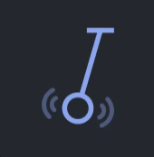
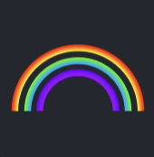
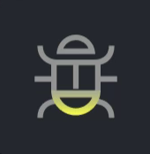
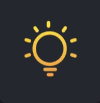
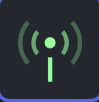
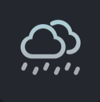
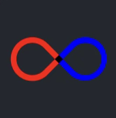
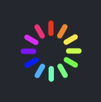
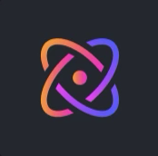
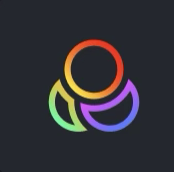

# RGB Light Effects Overview

Documentation of all light effects available in the app, plus how to trigger them via the `Channel/SetRGBInfo` API call (Home Assistant / Postman).

---

## 1. App overview: effect icons

The app shows effects as icon buttons in a grid. The icon is your quickest way to find an effect by name when switching between the app and the API.

> ⚠️ **The app occasionally shows the wrong icon** for an effect depending on the active mode. The most notable case: grid position 6 (ID `5`) shows a **Bulb** icon in Edgelight/Backlight mode but an **Antenna** icon in All Lights mode — yet the underlying effect ID is identical. Similarly, **Flame** in Edgelight sits at the same grid position as **Bulb** in Backlight. Don't rely on the icon alone — use the grid position (button index) to find the ID.

> 💡 **Finding an effect's ID:** count the button's position in the Light Effect grid (left-to-right, top-to-bottom, starting at 1) and subtract 1. E.g. the 4th button = ID `3`. Button position 6 (ID `5`) is always the pre-selected default when you open a light mode.

> ⚠️ **Backlight uses a different ID mapping than Edgelight / All Lights.** The same ID number produces a completely different effect on Backlight. Effect IDs for All Lights and Edgelight match 1:1. See the per-scenario tables in §2.

| Icon | Effect name |
|---|---|
|  | Sparkle |
|  | Pendulum |
|  | Rainbow |
|  | Beetle |
|  | Bulb |
|  | Flame *(shown as Bulb icon in Backlight — app icon bug)* |
|  | Antenna *(shown as Flame icon in Edgelight — app icon bug)* |
|  | Waves |
|  | Rain |
|  | Heart |
|  | Infinity |
|  | Rocket |
|  | Color wheel |
|  | Atom |
|  | Chat |
|  | Circles |

### 1a. Backlight — behavior per effect

| Icon | Effect | Effect ID (Backlight) | Customizable color | Description |
|---|---|---|---|---|
|  | Beetle | 0 | ❌ | Rainbow effect without animation: the colors blend statically into one another, all 5 leds show the same gradient. |
|  | Atom | 1 | ❌ | Orange and red leds slowly alternating with each other. |
|  | Pendulum | 2 | ❌ | Fixed color per led position: left red, middle yellow, right green. Leds turn on/off randomly and slowly. |
|  | Sparkle | 3 | ❌ | Rainbow colors slowly blending into one another. |
|  | Rainbow | 4 | ✅ | Effect across all 5 leds at once: the leds fade in in the chosen color, then fade out to black, and the pattern repeats — a pulsing effect in the chosen color. |
|  | Bulb | 5 | ✅ | All leds light up solidly in the user's chosen color. *("Solid" in HA)* |
|  | Infinity | 6 | ✅ | Leds light up slightly brighter one by one in the chosen color — a race effect from left to right. |
|  | Chat | 7 | ✅ | Leds turn on from outside to inside in the chosen color: first leds 1 and 5, then 2 and 4, then back — a repeating back-and-forth pattern. |
|  | Antenna | 8 | ✅ | Leds turn on one by one from left to right and back — similar to a radar scan. |
|  | Waves | 9 | ✅ | Leds turn on shortly after one another in the chosen color and stay lit, then fade out together. |
|  | Rain | 10 | ✅ | Leds randomly light up fully in the chosen color, followed by a fade-out — a raindrop effect. |
|  | Circles | 11 | ✅ | Leds slowly light up with a fade-in one by one from left to right in the chosen color — the pattern continuously shifts along. |

*(Flame, Heart, Rocket and Color wheel are not available for Backlight.)*

### 1b. Edgelight — behavior per effect

| Icon | Effect | Effect ID (Edgelight) | Customizable color | Description |
|---|---|---|---|---|
|  | Sparkle | 0 | ❌ | Pastel rainbow colors moving very slowly from bottom to top. |
|  | Pendulum | 1 | ❌ | Alternates between red and orange, at the bottom. |
|  | Rainbow | 2 | ❌ | Rainbow colors, 4 colors at once, randomly and slowly fading in and out. |
|  | Beetle | 3 | ❌ | Rainbow — all leds change color together, with standard fade transitions. |
|  | Bulb | 4 | ✅ | Breathing effect — the leds gently fade up and down in the chosen color. |
|  | Flame | 5 | ❌ | Light is simply on, no animation. *(App shows Bulb icon here in Backlight mode — icon bug.)* |
|  | Waves | 6 | ❌ | Rainbow effect lighting up: first the left led cluster, then the right. |
|  | Rain | 7 | ❌ | Rainbow leds flash on and then fade out. |
|  | Heart | 8 | ✅ | Leds turn on left side first then move right, in the chosen color. |
|  | Infinity | 9 | ✅ | Both sides in sync: leds turn on from top to bottom — a breathing effect top-to-bottom. |
|  | Rocket | 10 | ❌ | Rainbow spinning around, from left to right. |
|  | Color wheel | 11 | ✅ | Leds on each side turn on from back to front, with a fade effect. |

*(Antenna, Atom, Chat and Circles are not available for Edgelight.)*

---

## 2. API — Home Assistant / Postman integration

The lighting is controlled via the `Channel/SetRGBInfo` command.

> ⚠️ **Behavior of the physical "light" button after using the API:** normally the physical light button cycles through effects for **both** Backlight and Edgelight together. However, after sending an API update with a specific `SelectLightIndex`, the physical button starts **only** controlling that same light group — the other is no longer affected. Sending `SelectLightIndex: 0` restores the button to controlling both groups again.

### 2a. Basic fields

| Field | Meaning |
|---|---|
| `SelectLightIndex` | Which light group to control: `0` = both, `1` = Edgelight, `2` = Backlight. Also determines which effect list applies to each `LightList` index. |
| `ColorCycle` | `1` = auto colour cycle after each effect loop; `0` = fixed colour. |
| `Color` | `#RRGGBB` — only applied on effects marked ✅ above; ignored on fixed-colour effects. |
| `Brightness` | 0–100 ambient brightness. |
| `OnOff` | `1` = on, `0` = off. *(Docs say the opposite — **wrong**.)* |
| `LightList` | Array of 3 items, each with `SelectEffect`. The role of each index shifts depending on `SelectLightIndex` — see scenarios below. |
| `KeyOnOff` | Turns the **physical button backlight** on (`1`) or off (`0`). |

> ⚠️ The `LightList` array has **no fixed meaning** — the role of each index shifts depending on `SelectLightIndex`. Always refer to the correct scenario below.

### 2b. Scenario 0 — `SelectLightIndex: 0` (Edgelight + Backlight together)

```json
{
    "Command": "Channel/SetRGBInfo",
    "LocalToken": <LocalToken>,
    "OnOff": 1,
    "Color": "#00FF00",
    "ColorCycle": 1,
    "Brightness": 100,
    "SelectLightIndex": 0,
    "LightList": [
        { "SelectEffect": 7 },
        { "SelectEffect": 0 },
        { "SelectEffect": 0 }
    ]
}
```

Only `LightList[0]` has effect — `[1]` and `[2]` are ignored. Both zones show the same effect.

| Array index | Light group | Effect ID range |
|---|---|---|
| `0` | **Edgelight + Backlight** (combined) | `0`–`11` |
| `1` | *(unused)* | — |
| `2` | *(unused)* | — |

**`LightList[0]` effect IDs — same mapping as Edgelight:**

| ID | Effect | ID | Effect |
|---|---|---|---|
| 0 | Sparkle | 6 | Waves |
| 1 | Pendulum | 7 | Rain |
| 2 | Rainbow | 8 | Heart |
| 3 | Beetle | 9 | Infinity |
| 4 | Bulb | 10 | Rocket |
| 5 | Flame / Antenna | 11 | Color wheel |

### 2c. Scenario 1 — `SelectLightIndex: 1` (Edgelight primary)

```json
{
    "Command": "Channel/SetRGBInfo",
    "LocalToken": <LocalToken>,
    "OnOff": 1,
    "Color": "#00FF00",
    "ColorCycle": 0,
    "Brightness": 100,
    "SelectLightIndex": 1,
    "LightList": [
        { "SelectEffect": 0 },
        { "SelectEffect": 7 },
        { "SelectEffect": 0 }
    ]
}
```

| Array index | Light group | Effect ID range |
|---|---|---|
| `0` | *(unused)* | — |
| `1` | **Edgelight** (primary) | `0`–`11` |
| `2` | **Backlight** (secondary theme) | `0`–`6` |

**`LightList[1]` — Edgelight effect IDs (0–11):** same table as Scenario 0.

**`LightList[2]` — Backlight secondary theme (0–6):**

| ID | Effect |
|---|---|
| 0 | Pastel rainbow |
| 1 | Fireplace (red/orange) |
| 2 | RGB flashing colors |
| 3 | Rainbow |
| 4 | RGB breathing colors |
| 5 | Solid RGB colors |
| 6 | Backlight off |

### 2d. Scenario 2 — `SelectLightIndex: 2` (Backlight primary)

```json
{
    "Command": "Channel/SetRGBInfo",
    "LocalToken": <LocalToken>,
    "OnOff": 1,
    "Color": "#00FF00",
    "ColorCycle": 0,
    "Brightness": 100,
    "SelectLightIndex": 2,
    "LightList": [
        { "SelectEffect": 0 },
        { "SelectEffect": 2 },
        { "SelectEffect": 5 }
    ]
}
```

| Array index | Light group | Effect ID range |
|---|---|---|
| `0` | *(unused)* | — |
| `1` | **Edgelight** (secondary theme) | `0`–`5` |
| `2` | **Backlight** (primary) | `0`–`11` |

**`LightList[2]` — Backlight effect IDs (0–11):**

| ID | Effect | Customizable color |
|---|---|---|
| 0 | Beetle | ❌ |
| 1 | Atom | ❌ |
| 2 | Pendulum | ❌ |
| 3 | Sparkle | ❌ |
| 4 | Rainbow | ✅ |
| 5 | Bulb *("Solid" in HA)* | ✅ |
| 6 | Infinity | ✅ |
| 7 | Chat | ✅ |
| 8 | Antenna | ✅ |
| 9 | Waves | ✅ |
| 10 | Rain | ✅ |
| 11 | Circles | ✅ |

**`LightList[1]` — Edgelight secondary theme (0–5):**

| ID | Effect |
|---|---|
| 0 | Pastel rainbow (cyberpunk style) |
| 1 | Dark red (Pendulum-like) |
| 2 | Bright green |
| 3 | Static rainbow |
| 4 | Very slow color cycle |
| 5 | Edgelight off |
